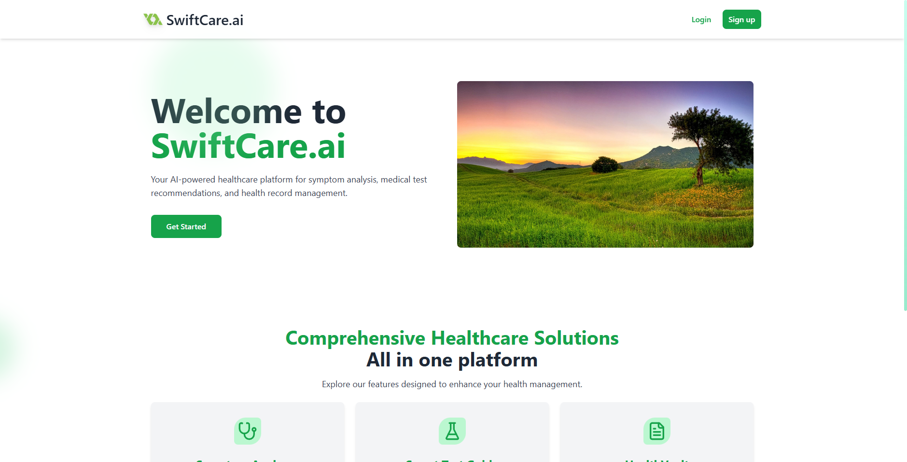
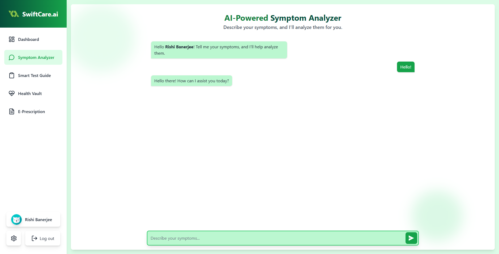
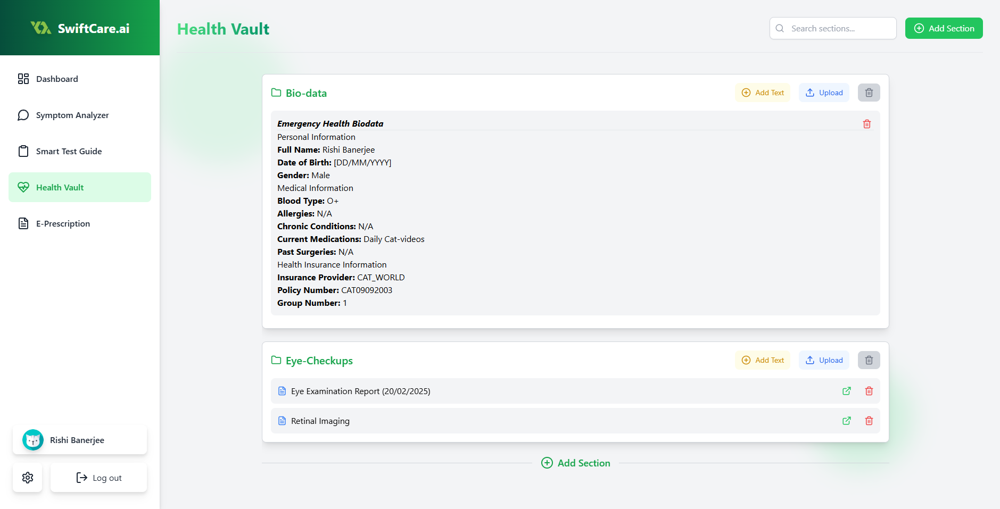
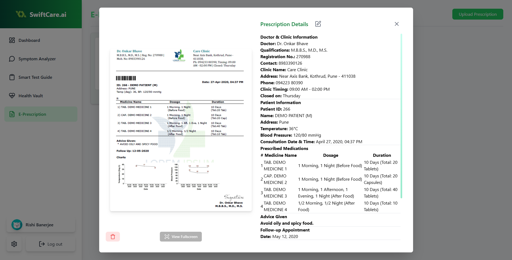

# 🍃 SwiftCare.ai


<p align="center"><strong>Your AI-powered healthcare assistant for quick and reliable medical advice!</strong></p>

**SwiftCare.ai** lets you have all your medical records and details saved at a secure portal, which you can refer to in case of any emergency. Also, a personalized AI chatbot will help you clear your doubts and will answer you your needs depending on your medical history.

---

## ✨ Features

✅ **... and plenty more!**

---

## ✨ Demo Website

We will host the demo website at [https://swiftcare-qwertyfusion.vercel.app](https://swiftcare-qwertyfusion.vercel.app) in future. Stay tuned!

---

## ✨ Preview

<div style="display: flex; justify-content: space-between;">
  
  
</div>

<div style="display: flex; justify-content: space-between;">
  
  
</div>

---

## 📜 License

SwiftCare.ai is open-source and released under the **MIT License**.  
See the [LICENSE](./LICENSE) file for more details.

---

## 🚀 Getting Started

### 1️⃣ Clone the Repository

```bash
https://github.com/QwertyFusion/SwiftCare.ai.git
cd SwiftCare.ai
```

### 2️⃣ Set Up Environment Variables in the `root` folder

Create a `.env` file and fill in the required fields as per `.env.example`.

### 3️⃣ Install Dependencies in `root` folder for backend dependencies:

```bash
npm install
# or
yarn install
# or
pnpm install
# or
bun install
```

### 4️⃣ Install Dependencies in `frontend` folder for frontend dependencies

```bash
cd .\frontend\
```

```bash
npm install
# or
yarn install
# or
pnpm install
# or
bun install
```

### 5️⃣ Run the backend server from the `root` folder

```bash
npm run dev
# or
yarn dev
# or
pnpm dev
# or
bun dev
```

Your backend should be running at [http://localhost:3000](http://localhost:3000)!

### 6️⃣ Run the frontend server from the `frontend` folder

```bash
cd .\frontend\
```

```bash
npm run dev
# or
yarn dev
# or
pnpm dev
# or
bun dev
```

Now, open [http://localhost:5173](http://localhost:5173) in your browser to see **SwiftCare.ai** in action!

---

<!-- 🛠 Tools Used -->
<h2>🛠 Tools Used</h2>
<ol>
  <li>Visual Studio Code</li>
  <li>Vite</li>
  <li>React.js</li>
  <li>JavaScript</li>
  <li>HTML</li>
  <li>CSS</li>
  <li>Tailwind CSS</li>
  <li>MongoDB</li>
  <li>Cloudinary (File Uploads)</li>
  <li>MailTrap (Email Testing)</li>
  <li>Gemini API (GenAI & AI Agent)</li>
  <li>LangChain (AI Memory & Conversations)</li>
  <li>Git & GitHub (Version Control)</li>
</ol>

<!-- 🔗 Link to Tools -->
<h2>🔗 Link to Tools</h2>
<p align="left">
<a href="https://code.visualstudio.com" target="_blank" rel="noreferrer">
  
</a>&emsp;
<a href="https://vitejs.dev/" target="_blank" rel="noreferrer">
  
</a>&emsp;
<a href="https://react.dev/" target="_blank" rel="noreferrer">
  
</a>&emsp;
<a href="https://developer.mozilla.org/en-US/docs/Web/JavaScript" target="_blank" rel="noreferrer">
  
</a>&emsp;
<a href="https://developer.mozilla.org/en-US/docs/Web/HTML" target="_blank" rel="noreferrer">
  
</a>&emsp;
<a href="https://developer.mozilla.org/en-US/docs/Web/CSS" target="_blank" rel="noreferrer">
  
</a>&emsp;
<a href="https://tailwindcss.com/" target="_blank" rel="noreferrer">
  
</a>&emsp;
<a href="https://www.mongodb.com/" target="_blank" rel="noreferrer">
  
</a>&emsp;
<a href="https://cloudinary.com/" target="_blank" rel="noreferrer">
  
</a>&emsp;
<a href="https://mailtrap.io/" target="_blank" rel="noreferrer">
  
</a>&emsp;
<a href="https://ai.google.dev/" target="_blank" rel="noreferrer">
  
</a>&emsp;
<a href="https://www.langchain.com/" target="_blank" rel="noreferrer">
  
</a>&emsp;
<a href="https://git-scm.com/" target="_blank" rel="noreferrer">
  
</a>&emsp;
<a href="https://github.com/" target="_blank" rel="noreferrer">
  
</a>
</p>

<!-- Developer Info -->
<h2>💻 Developer</h2>
<ul>
  <li><a href="https://github.com/QwertyFusion">[@QwertyFusion]</a></li>
  <li><a href="https://github.com/SHREEYA-DAS">[@SHREEYA-DAS]</a></li>
  <li><a href="https://github.com/Apratim23">[@Apratim23]</a></li>
  <li><a href="https://github.com/Anurag0804">[@Anurag0804]</a></li>
</ul>
